

# NovelReel

### Turn web novels into cinematic videos with LLMs and visual generative models

An open-source pipeline for adapting long-form web fiction into scripts,
consistent characters, visual shots, narration, and finished videos.

[Introduction](#introduction) · [Workflow](#workflow) · [Characters](#character-showcase) · [Examples](#video-examples)

## Introduction

**NovelReel** is an AI short-drama production pipeline designed specifically
for web novels. It transforms novels into complete AI short dramas while
maintaining consistent characters (appearance and voice), props, and scenes.
The entire production process requires no manual intervention.

### Core Features

#### 1. Automated Web Novel to AI Short Drama

- Automatically extracts characters, props, and scenes, then generates their
  corresponding reference images
- Preserves character, prop, and scene consistency across chapters
- Automatically structures screenplays and generates videos with narrative
  continuity

#### 2. Intelligent Voice Generation

- Assigns a consistent voice to each character
- Calibrates and preserves character voice consistency across shots

## Workflow

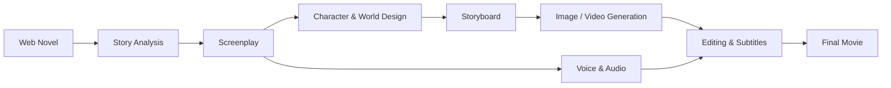

1. Parse the novel and extract characters, locations, events, and timelines.
2. Adapt the source text into scenes, dialogue, narration, and camera directions.
3. Generate reusable character references and storyboard frames.
4. Produce video shots while preserving visual consistency.
5. Add voices, music, sound effects, subtitles, and export the final movie.

## Examples

Each example contains two character reference sheets and two consecutive
chapters. Click a chapter button to watch the video with audio.

### 1. The Lost Tomb

<table>
  <tr>
    <td align="center" width="50%">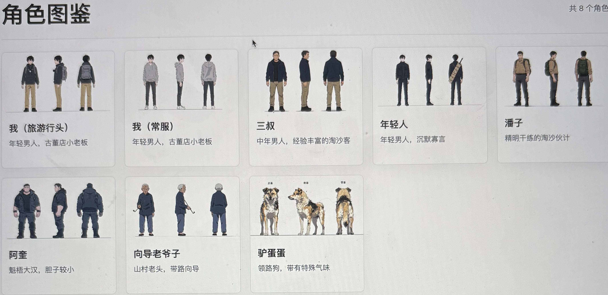 <b>Character Reference 1</b></td>
    <td align="center" width="50%">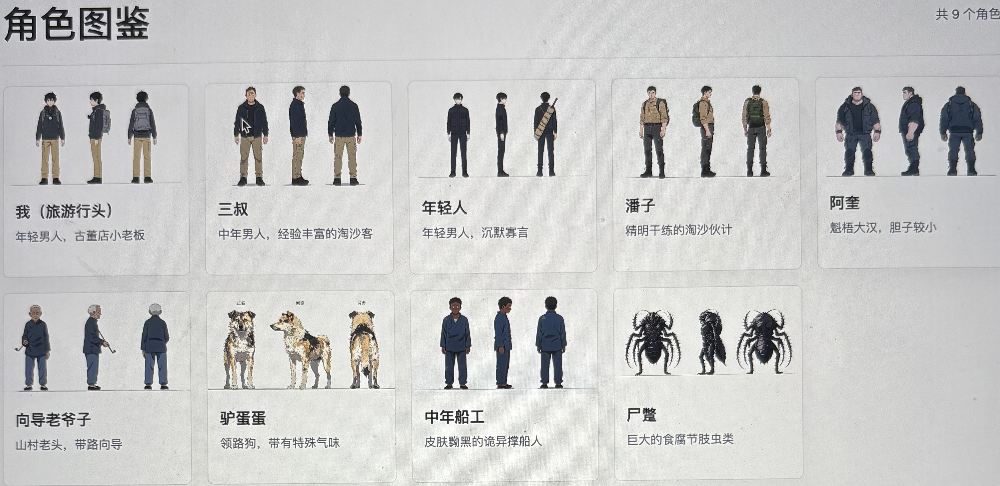 <b>Character Reference 2</b></td>
  </tr>
  <tr>
    <td align="center"><a href="https://youtu.be/ba7dlY-buiY">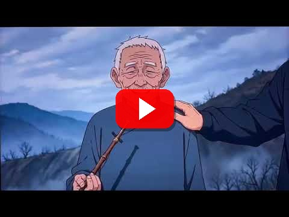</a> <b>Chapter 1</b></td>
    <td align="center"><a href="https://youtu.be/npjA1qq8AhM">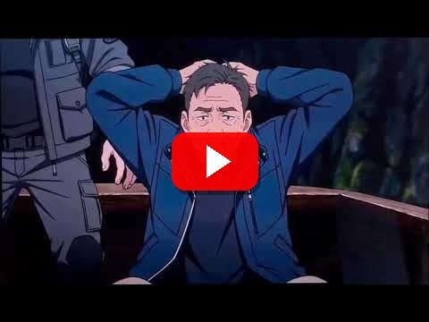</a> <b>Chapter 2</b></td>
  </tr>
</table>

### 2. Maoshan Ghost Hunter

<table>
  <tr>
    <td align="center" width="50%">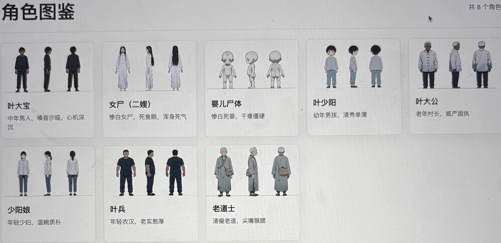 <b>Character Reference 1</b></td>
    <td align="center" width="50%">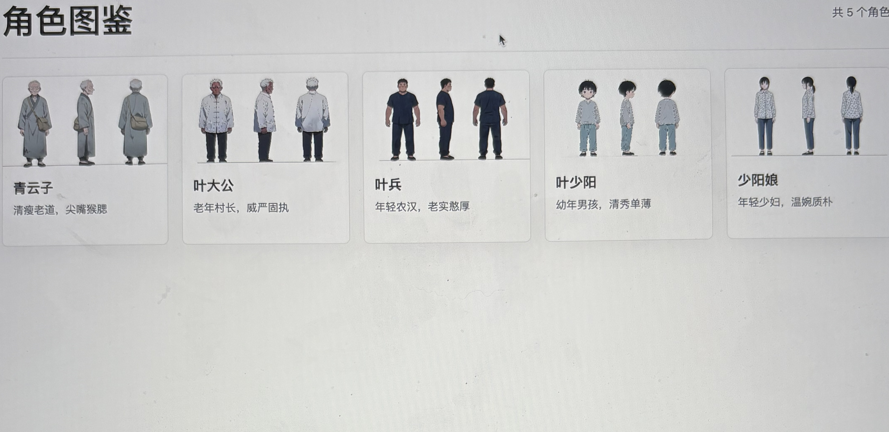 <b>Character Reference 2</b></td>
  </tr>
  <tr>
    <td align="center"><a href="https://youtu.be/GVt8tebEKvA">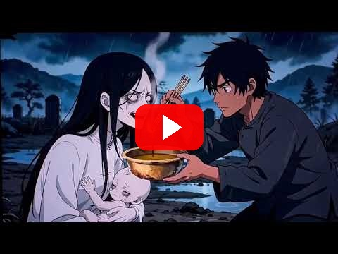</a> <b>Chapter 1</b></td>
    <td align="center"><a href="https://youtu.be/mdMaMKaI8Bc">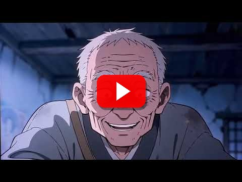</a> <b>Chapter 2</b></td>
  </tr>
</table>

### 3. Scavenging at the End of the World

<table>
  <tr>
    <td align="center" width="50%">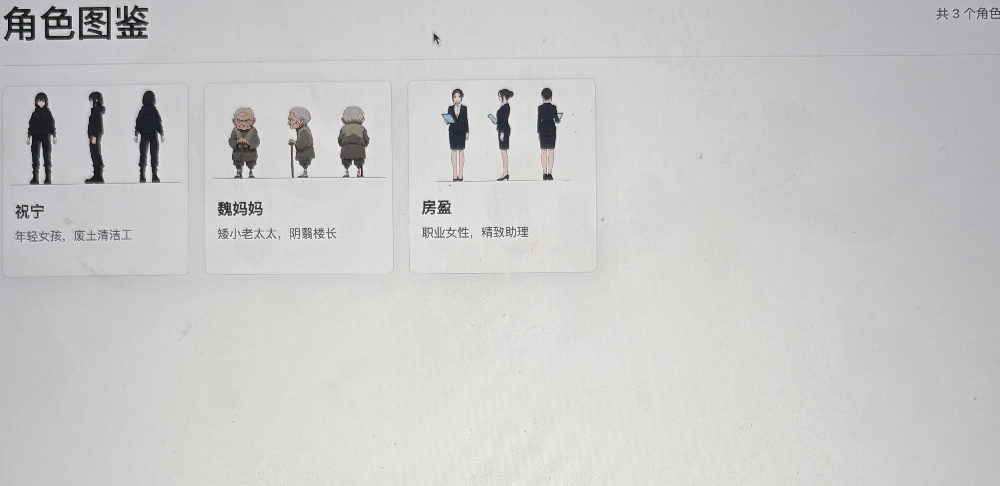 <b>Character Reference 1</b></td>
    <td align="center" width="50%">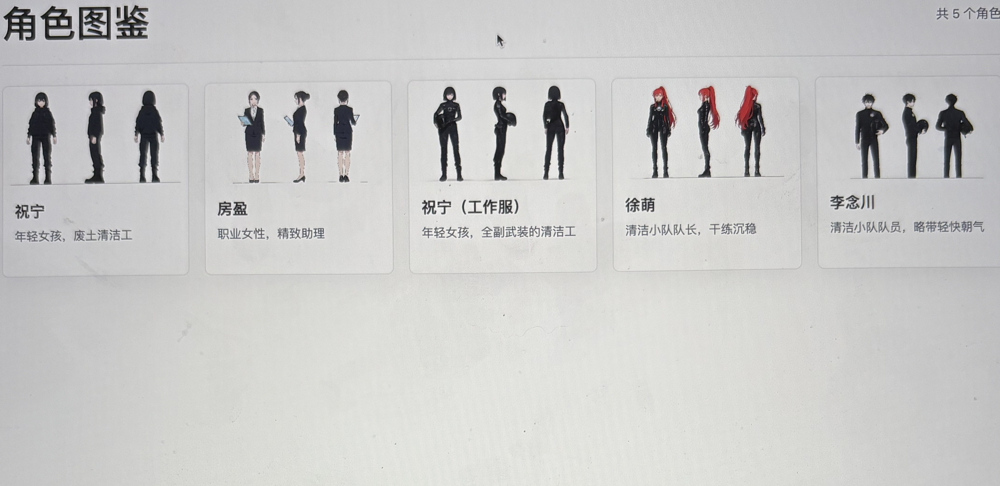 <b>Character Reference 2</b></td>
  </tr>
  <tr>
    <td align="center"><a href="https://youtu.be/9-AosqKD1IE">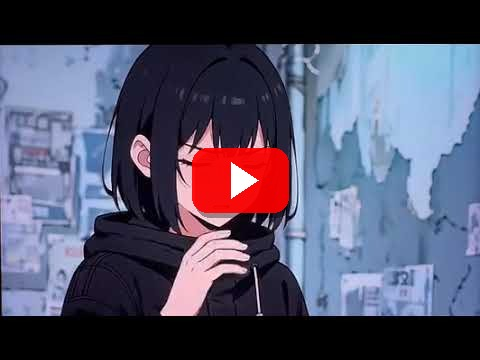</a> <b>Chapter 1</b></td>
    <td align="center"><a href="https://youtu.be/JrzBbX469sA">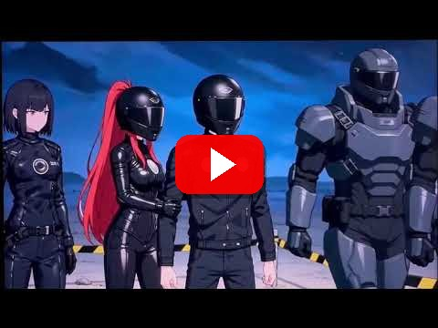</a> <b>Chapter 2</b></td>
  </tr>
</table>

### 4. Stellar Transformations

<table>
  <tr>
    <td align="center" width="50%">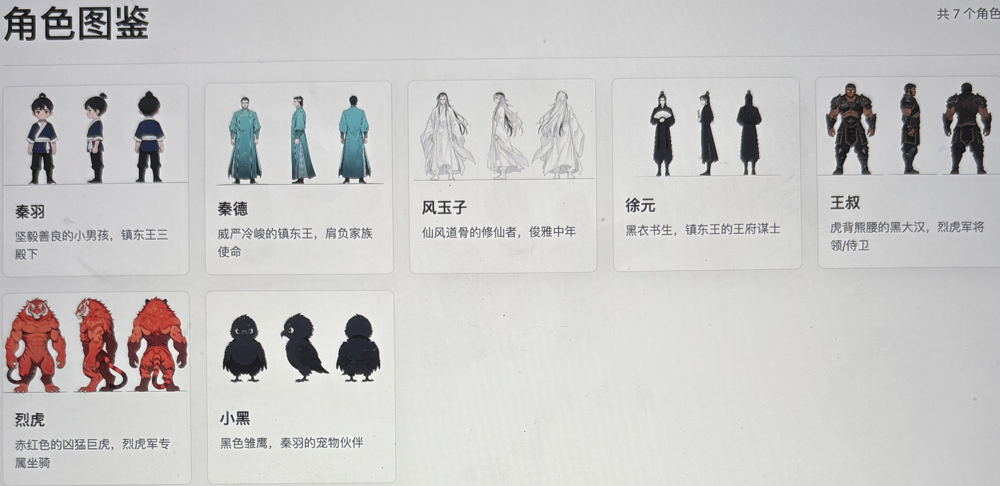 <b>Character Reference 1</b></td>
    <td align="center" width="50%">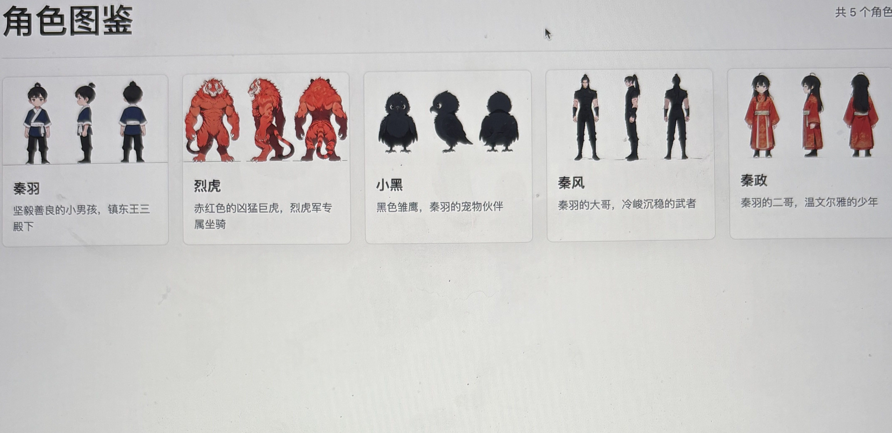 <b>Character Reference 2</b></td>
  </tr>
  <tr>
    <td align="center"><a href="https://youtu.be/OesS29j5fVw">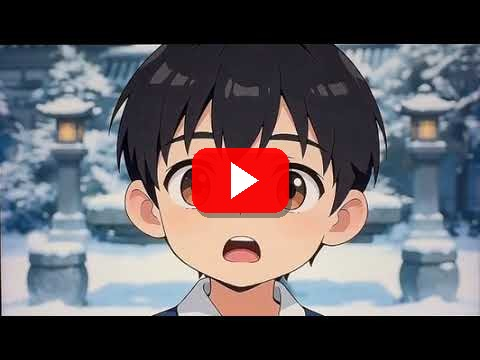</a> <b>Chapter 1</b></td>
    <td align="center"><a href="https://youtu.be/AsaULb0MdGM">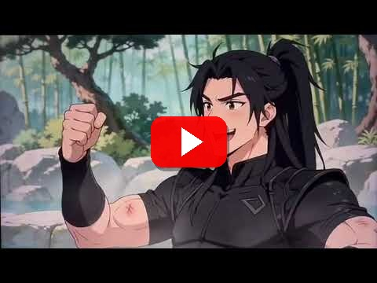</a> <b>Chapter 2</b></td>
  </tr>
</table>
