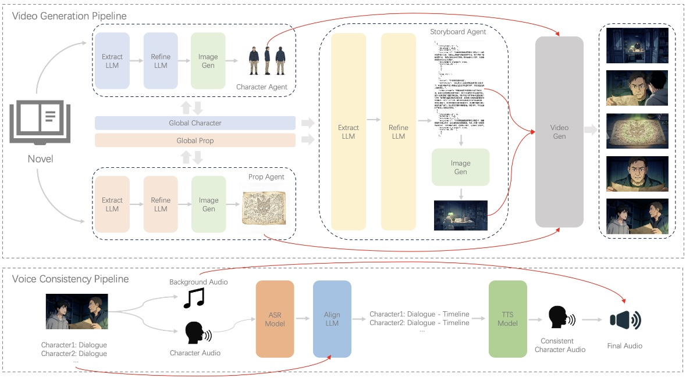
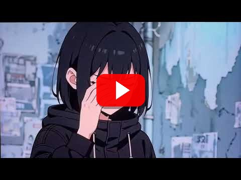
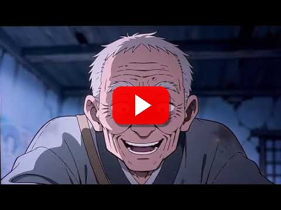

# NovelReel

### 将网络小说转化为角色一致、电影级的 AI 短剧

一个由 LLM 和视觉生成模型驱动的端到端开源制作流水线。

  
  
  
  

  
  

[项目介绍](#项目介绍) · [工作流程](#工作流程) · [案例展示](#案例展示) · [音色对比](#角色音色一致性对比)

---

## 项目介绍

**NovelReel** 是一个专为网络小说设计的 AI 短剧制作流水线。它可以将小说
转化为完整的 AI 短剧，并保持角色（形象与音色）、道具和场景的一致性。
整个制作过程无需人工介入。

### 核心能力

<table>
  <tr>
    <td width="50%"><b>自动化小说改编</b> 提取故事元素、编排剧本，并生成剧情连续的 AI 短剧。</td>
    <td width="50%"><b>视觉一致性</b> 保持角色形象、道具和场景在跨章节、跨镜头时的一致性。</td>
  </tr>
  <tr>
    <td width="50%"><b>角色音色一致性</b> 为每个角色分配并校准稳定音色，贯穿完整故事。</td>
    <td width="50%"><b>端到端制作</b> 串联故事分析、参考图、分镜、视频生成和最终音频制作。</td>
  </tr>
</table>

## 工作流程

  
   
  NovelReel 视频生成与角色音色一致性流水线。

 

1. 解析小说，提取角色、地点、事件和故事时间线。
2. 建立跨章节共享的全局角色与道具参考。
3. 将原文改编为剧本、分镜和镜头描述。
4. 在保持角色、道具和场景一致的前提下生成视频镜头。
5. 分离对白、对齐说话角色、统一角色音色并生成最终音频。

---

## 案例展示

每个案例包含两张角色设定图和两个连续章节。点击视频封面即可观看带音频的生成结果。

### 1. 盗墓笔记

<table>
  <tr>
    <th></th>
    <th align="center">第一章</th>
    <th align="center">第二章</th>
  </tr>
  <tr>
    <th align="center">角色设定图</th>
    <td align="center"></td>
    <td align="center"></td>
  </tr>
  <tr>
    <th align="center">生成视频片段</th>
    <td align="center"></td>
    <td align="center"></td>
  </tr>
</table>

### 2. 茅山捉鬼人

<table>
  <tr>
    <th></th>
    <th align="center">第一章</th>
    <th align="center">第二章</th>
  </tr>
  <tr>
    <th align="center">角色设定图</th>
    <td align="center"></td>
    <td align="center"></td>
  </tr>
  <tr>
    <th align="center">生成视频片段</th>
    <td align="center"></td>
    <td align="center"></td>
  </tr>
</table>

### 3. 我在末日扫垃圾

<table>
  <tr>
    <th></th>
    <th align="center">第一章</th>
    <th align="center">第二章</th>
  </tr>
  <tr>
    <th align="center">角色设定图</th>
    <td align="center"></td>
    <td align="center"></td>
  </tr>
  <tr>
    <th align="center">生成视频片段</th>
    <td align="center"></td>
    <td align="center"></td>
  </tr>
</table>

### 4. 星辰变

<table>
  <tr>
    <th></th>
    <th align="center">第一章</th>
    <th align="center">第二章</th>
  </tr>
  <tr>
    <th align="center">角色设定图</th>
    <td align="center"></td>
    <td align="center"></td>
  </tr>
  <tr>
    <th align="center">生成视频片段</th>
    <td align="center"></td>
    <td align="center"></td>
  </tr>
</table>

---

## 角色音色一致性对比

对同一角色跨镜头、跨章节的音色进行校准，使角色声音在连续剧情中保持一致。
点击封面可观看并对比处理前后的完整视频。

### 对比例子 1

<table>
  <tr>
    <th align="center">角色音色一致化前</th>
    <th align="center">角色音色一致化后</th>
  </tr>
  <tr>
    <td align="center"></td>
    <td align="center"></td>
  </tr>
</table>

### 对比例子 2

<table>
  <tr>
    <th align="center">角色音色一致化前</th>
    <th align="center">角色音色一致化后</th>
  </tr>
  <tr>
    <td align="center"></td>
    <td align="center"></td>
  </tr>
</table>
