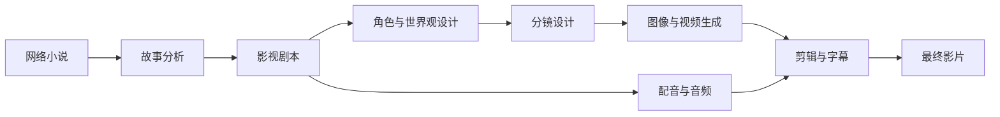

# NovelReel

### 使用 LLM 和视觉生成模型将网络小说转化为电影级视频

一个面向网络小说的开源 AI 短剧制作流程，将长篇小说自动转化为剧本、
角色、分镜、配音和完整视频。

[项目介绍](#项目介绍) · [工作流程](#工作流程) · [角色展示](#角色展示) · [视频案例](#视频案例)

## 项目介绍

**NovelReel** 是一个专为网络小说设计的 AI 短剧制作流水线。它可以将小说
转化为完整的 AI 短剧，并保持角色（形象与音色）、道具和场景的一致性。
整个制作过程无需人工介入。

### 核心功能

#### 1. 自动化小说转 AI 短剧

- 自动提取角色、道具和场景，并生成对应的参考图
- 保持跨章节角色、道具和场景的一致性
- 自动编排剧本并生成剧情连续的视频

#### 2. 智能配音

- 为每个角色分配统一的音色
- 校准并保持角色跨镜头的音色一致性

## 工作流程

1. 解析小说，提取角色、地点、事件和故事时间线。
2. 将原文改编为场景、对白、旁白和镜头描述。
3. 生成可重复使用的角色设定图和分镜画面。
4. 在保持角色与视觉风格一致的前提下生成视频镜头。
5. 添加配音、音乐、音效和字幕，导出最终影片。

## 案例展示

### 1. 盗墓笔记

<table>
  <tr>
    <th></th>
    <th align="center">第一章</th>
    <th align="center">第二章</th>
  </tr>
  <tr>
    <th align="center">角色设定图</th>
    <td align="center"></td>
    <td align="center"></td>
  </tr>
  <tr>
    <th align="center">生成视频片段</th>
    <td align="center"></td>
    <td align="center"></td>
  </tr>
</table>

### 2. 茅山捉鬼人

<table>
  <tr>
    <th></th>
    <th align="center">第一章</th>
    <th align="center">第二章</th>
  </tr>
  <tr>
    <th align="center">角色设定图</th>
    <td align="center"></td>
    <td align="center"></td>
  </tr>
  <tr>
    <th align="center">生成视频片段</th>
    <td align="center"></td>
    <td align="center"></td>
  </tr>
</table>

### 3. 我在末日扫垃圾

<table>
  <tr>
    <th></th>
    <th align="center">第一章</th>
    <th align="center">第二章</th>
  </tr>
  <tr>
    <th align="center">角色设定图</th>
    <td align="center"></td>
    <td align="center"></td>
  </tr>
  <tr>
    <th align="center">生成视频片段</th>
    <td align="center"></td>
    <td align="center"></td>
  </tr>
</table>

### 4. 星辰变

<table>
  <tr>
    <th></th>
    <th align="center">第一章</th>
    <th align="center">第二章</th>
  </tr>
  <tr>
    <th align="center">角色设定图</th>
    <td align="center"></td>
    <td align="center"></td>
  </tr>
  <tr>
    <th align="center">生成视频片段</th>
    <td align="center"></td>
    <td align="center"></td>
  </tr>
</table>
