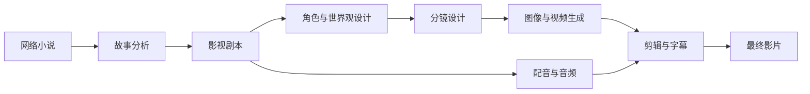

# NovelReel

### 使用 AI 将网络小说转化为电影级视频

一个面向网络小说的开源 AI 影视制作流程，将长篇小说自动转化为剧本、
角色、分镜、配音和完整视频。

[项目介绍](#项目介绍) · [工作流程](#工作流程) · [角色展示](#角色展示) · [视频案例](#视频案例)

## 项目介绍

**NovelReel** 是一个专为网络小说设计的 AI 影视制作工具。它可以将小说章节
转化为结构化场景，保持角色和画面的一致性，生成镜头与配音，并自动合成为完整视频。

本项目面向内容创作者和开发者，目标是提供一套可复现、可编辑、可扩展的
小说转视频工作流。

### 核心功能

- 长篇小说和章节解析
- 自动生成影视剧本与镜头列表
- 保持角色、服装和场景的一致性
- 支持文生图、图生视频和文生视频
- 支持多角色对白、旁白、音乐和音效
- 自动剪辑、字幕生成与成片导出

## 工作流程

1. 解析小说，提取角色、地点、事件和故事时间线。
2. 将原文改编为场景、对白、旁白和镜头描述。
3. 生成可重复使用的角色设定图和分镜画面。
4. 在保持角色与视觉风格一致的前提下生成视频镜头。
5. 添加配音、音乐、音效和字幕，导出最终影片。

## 角色展示

<table>
  <tr>
    <td align="center"> <b>悬疑冒险</b></td>
    <td align="center"> <b>灵异奇幻</b></td>
  </tr>
  <tr>
    <td align="center"> <b>末日世界</b></td>
    <td align="center"> <b>东方修仙</b></td>
  </tr>
</table>

## 视频案例

点击预览图即可打开带音频的视频。

<table>
  <tr>
    <td align="center">
      
       <b>悬疑冒险</b>
    </td>
    <td align="center">
      
       <b>灵异奇幻</b>
    </td>
  </tr>
  <tr>
    <td align="center">
      
       <b>末日题材</b>
    </td>
    <td align="center">
      
       <b>东方修仙</b>
    </td>
  </tr>
</table>

## 开发计划

- [ ] 小说解析与知识库
- [ ] 剧本和分镜生成
- [ ] 角色一致性工作流
- [ ] 配音与音频生成
- [ ] 自动化视频剪辑
- [ ] Web 界面与本地部署

## 参与贡献

NovelReel 目前处于早期开发阶段。欢迎提交 Issue、功能建议、文档改进、
模型集成方案和 Pull Request。

## 开源协议

本项目将采用开源协议发布。使用小说原文、生成素材、人物声音、音乐或
第三方模型进行创作前，请确认你拥有相应的使用权。

